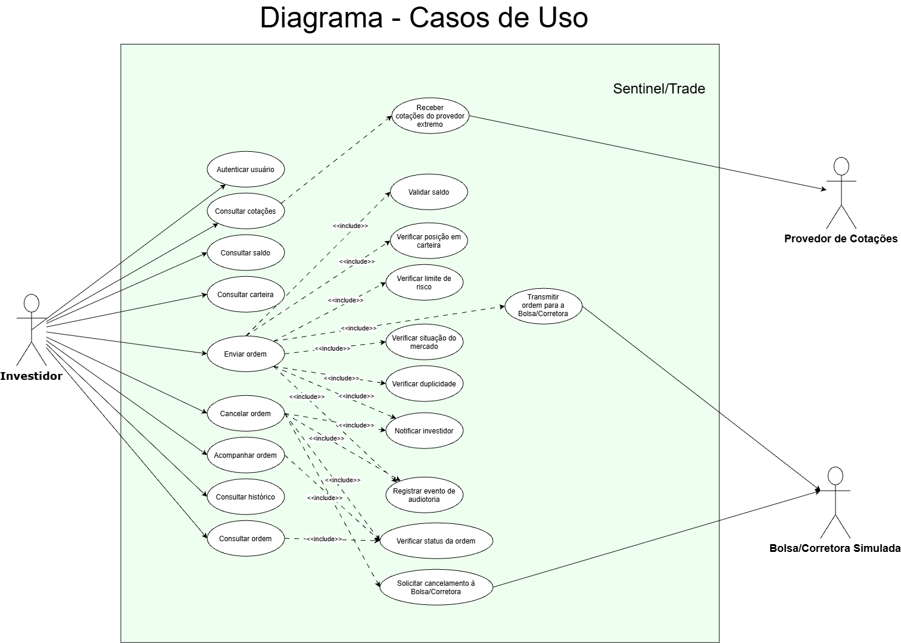

# SentinelTrade

**Sistema de Trade Financeiro de Alta Criticidade** — Projeto da disciplina Projeto de Software.

Este repositório reúne a **especificação** e a **modelagem** do SentinelTrade: requisitos, casos de uso e diagramas UML.

---

## Visão do projeto

A corretora fictícia **Orion Capital** opera uma plataforma digital de negociação de ações, ETFs e fundos imobiliários. Hoje, suas operações dependem de sistemas pouco integrados, o que dificulta a rastreabilidade das ordens, o controle de risco e a auditoria.

O **SentinelTrade** é a plataforma proposta para resolver esse problema. Como decisões erradas, atrasadas ou não auditáveis geram impacto financeiro, regulatório e reputacional, o sistema é projetado como uma plataforma **distribuída, segura, escalável e tolerante a falhas**.

---

### O que o sistema deve fazer

- autenticar usuários com MFA;
- manter dados de investidores, contas, carteiras, ativos e limites financeiros;
- receber cotações em tempo quase real de um provedor externo;
- permitir ordens de compra, venda, cancelamento e consulta;
- validar saldo, posição em carteira, limite de risco e situação do mercado antes de transmitir a ordem;
- integrar-se a uma Bolsa/Corretora simulada e acompanhar o ciclo de vida das ordens;
- registrar logs de auditoria imutáveis;
- notificar o investidor sobre execução, rejeição, cancelamento ou falha;
- operar com mecanismos de recuperação, indisponibilidade controlada e prevenção de duplicidade de ordens.

---

### Atores

| Ator | Descrição |
|---|---|
| Investidor | Usuário autorizado que consulta informações e realiza operações. |
| Provedor de Cotações | Sistema externo que fornece cotações simuladas ao SentinelTrade. |
| Bolsa/Corretora Simulada | Sistema externo que recebe ordens válidas e retorna eventos de processamento. |

---

## Integrantes

| Nome | RA |
|---|---|
| Beatriz Paulino Gomes | 10738760 |
| Carolina Viana Belam | 10744294 |
| Sarah Krybus Chalom | 10738666 |

---

## Tecnologias e ferramentas

| Ferramenta | Uso no projeto |
|---|---|
| Markdown | Escrita da documentação (requisitos e casos de uso). |
| UML | Modelagem do sistema (diagrama de casos de uso). |
| Git e GitHub | Versionamento e hospedagem do repositório privado. |
| draw.io | Desenvolvimento do diagrama

---

## Estrutura do repositório

```
.
├── README.md
├── .gitignore
├── .env.example
└── docs/
    ├── casos-de-uso/
    │   └── especificacao-casos-de-uso.md
    ├── requisitos/
    │   ├── requisitos-funcionais.md
    │   └── requisitos-nao-funcionais.md
    └── uml/
        └── diagrama-casos-de-uso.png
```

---

## Documentação

| Documento | Conteúdo |
|---|---|
| [Requisitos funcionais](docs/requisitos/requisitos-funcionais.md) | 17 requisitos (RF-01 a RF-17). |
| [Requisitos não funcionais](docs/requisitos/requisitos-nao-funcionais.md) | 11 requisitos (RNF-01 a RNF-11). |
| [Especificação dos casos de uso](docs/casos-de-uso/especificacao-casos-de-uso.md) | Atores e 9 casos de uso (UC-01 a UC-09), com fluxos principais e alternativos. |
| [Diagrama de casos de uso](docs/uml/diagrama-casos-de-uso.png) | Visão gráfica dos casos de uso e dos atores. |


